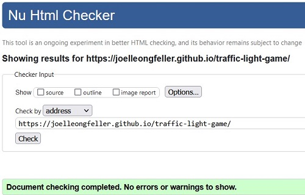
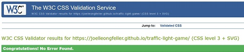
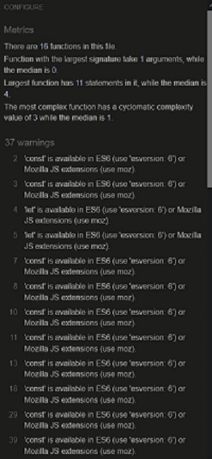
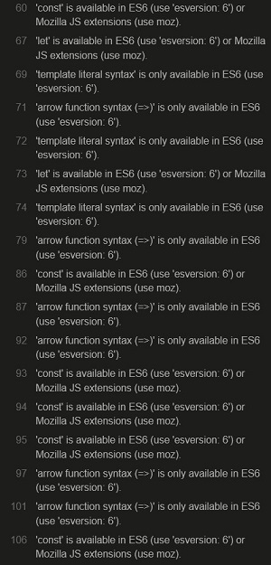
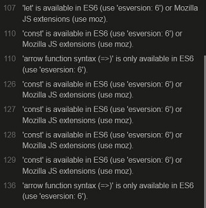
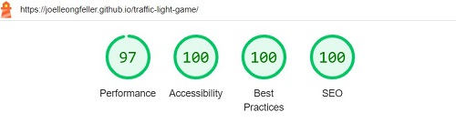

# Traffic Game

Traffic game is a website traffic light game for people of all ages to get to know the trafic light signals in a fun and entertaining way. You can visit the site [here](https://joelleongfeller.github.io/traffic-light-game/)

## Features

---

### At first glance
- Before starting the game you have a title, two buttons and a footer.

- As soon as you press start game you are taken to the game area wich has control buttons a trafic light with a score area and a quit button. 

### heading
- Is located at the top of the page.
- The title Traffic Game makes it clear to the player what this game is about.
- The title is present at all times.

### Start button
- Is located under the heading and apears only before the game starts or when game is quited, and is there to launch the game.

### Rules 
- Same as for the start button the rules button only apears before or after the game. Its there to get a better understanding about the game and how to play it.

### Footer
- The footer has a copyright icon with the authors name.

- When clicked on the name it brings you to the authors github.

### Game Area 
- The game area has a timer that tells you how long you have before the game ends and once it ends it tells you your score.

- It has a traffic light that changes color at random and you have to correctly drive or wait.

- The drive and wait control buttons were placed on opposite sides of the trafic light.

- Your correct and incorrect answers will be displayed on the bottom of the page while the time is still ticking so you always know your score.

 

- A quit button is provided for the player at the bottom of the page to restart or quit the game at any time.

## Testing
---
- I tested that this page work in different browsers: Chrome, Firefox & Microsoft Edge.
- I confirmed that this project is responsive, looks good and functions on all standard screen sizes using the DevTools device toolbar.
- I confirmed that the websites text is all readeable and easy to understand.

### Validation Testing

- HTML

- CSS

- JavaScript

The warnings can be ignored.

- Accessibility

I confirmed that the colors and fonts chosen are easy to read and accessible by running lighthouse in DevTools.

## Deployment

---

The site was deployed to GitHub pages. The steps to deploy are:
- In the GitHub repository, navigate to the Settings tab.
- From the source section drop-down menu, select the Master Branch.
- Once the Master Branch has been selected, the page provided the link to the completed website.

The live link can be found here - [Traffic Game](https://joelleongfeller.github.io/traffic-light-game/)

## credits
---
My father gave me the idea to make a traffic game and the container traffic light was taken from Youtube the link to the video can be found here - [The video](https://www.youtube.com/watch?v=8vagi0PJbM0&t=200s)

