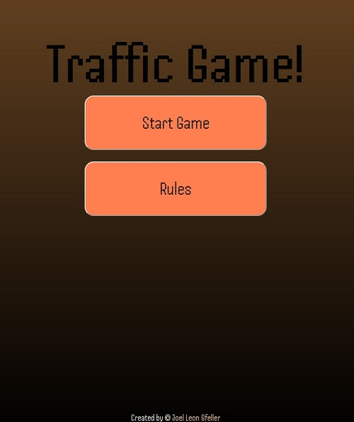
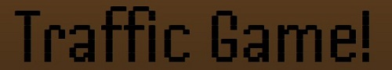
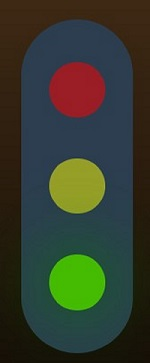

# Traffic Game

Traffic game is a website traffic light game for people of all ages to get to know the trafic light signals in a fun and entertaining way. You can visit the site [here](https://joelleongfeller.github.io/traffic-light-game/)

## Features

---

### At first glance
- Before starting the game you have a title, two buttons and a footer.

- As soon as you press start game you are taken to the game area wich has control buttons a trafic light with a score area and a quit button. 

### heading
- Is located at the top of the page.
- The title Traffic Game makes it clear to the player what this game is about.
- The title is present at all times.

### Start button
- is located under the heading and apears only before the game starts or when game is quited, and is there to launch the game.

### Rules 
- same as for the start button the rules button only apears before or after the game. Its there to get a better understanding about the game and how to play it.

### Footer
- The footer has a copyright icon with the authors name.

- When clicked on the name it brings you to the authors github.

### Game Area 
- The game area has a timer that tells you how long you have before the game ends and once it ends it tells you your score.

- It has a traffic light that changes color at random and you have to correctly drive or wait.

- The drive and wait control buttons were placed on opposite sides of the trafic light.

- Your correct and incorrect answers will be displayed on the bottom of the page while the time is still ticking so you always know your score.

 

- A quit button is provided for the player at the bottom of the page to restart or quit the game at any time.

 
